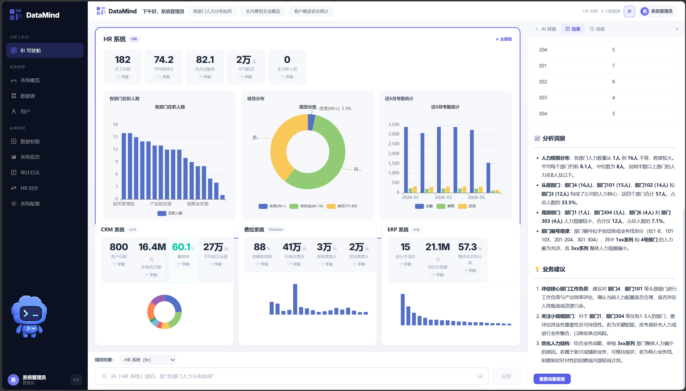

# DataMind

DataMind 是一个面向企业白领的 **AI 数据自助分析平台**。一次 HR 系统同步后，业务人员即可用自然语言查询和分析自己权限内的业务数据，无需学习 SQL。

---

## 它能做什么

用中文提问，AI 理解你的意图，在你权限范围内查询数据，生成带分析的报告：

**数据查询**

- "各部门预算情况" → 返回各部门预算排名与占比分析
- "我的个人信息" → 返回你的个人档案（入职、绩效等）
- "绩效排名最高的员工" → 返回绩效 Top 员工名单

**权限控制**

- "我的薪资情况" → 员工可查看自己薪资
- "其他人的薪资" → 被权限系统拦截，提示权限不足
- "各部门人力分布" → 部门负责人只看到自己团队的数据

**智能报告**

每次查询都会生成结构化的 Markdown 报告，包含分析结论、数据表格和业务建议。

---

## 架构

```
用户 → HTTP POST /api/query/ask + JWT Token
                │
        ┌───────┴────────┐
        │   API 层        │  鉴权 → 意图解析 → 调用查询引擎
        └───────┬────────┘
                │
        ┌───────┴────────┐
        │  MCP 查询引擎    │  权限校验 → 注入用户上下文
        └───────┬────────┘
                │
        ┌───────┴────────┐
        │  MCP Server 层  │  HR / CRM / 费控 / ERP 业务工具
        │  + MCPAuth 权限  │  列级可见性 + 行级 RLS + 数据脱敏
        └───────┬────────┘
                │
        ┌───────┴────────┐
        │  报告层          │  LLM 生成 Markdown 分析报告
        └────────────────┘
```

核心设计：每个业务系统封装为独立的 MCP Server，暴露结构化业务工具（如 `get_department_budget`、`get_employee_detail`）。AI Agent 通过 function calling 选择合适的工具，权限在工具内部自动执行。

---

## 快速启动

### 环境要求

- **Python 3.12+**（后端）
- **Node.js 18+**（前端，可选）

### 后端

```bash
cd backend
python -m venv .venv

# Windows
.venv\Scripts\pip install -r requirements.txt

# 配置环境变量
copy .env.example .env
# 编辑 .env，填入 DEEPSEEK_API_KEY

# 启动
.venv\Scripts\uvicorn app.main:app --host 127.0.0.1 --port 8000 --log-level info
```

首次启动会自动创建 SQLite 数据库、生成 4 个 demo 业务库、同步用户数据。

### 前端

```bash
cd frontend
npm install
npm run dev
```

### 测试账户

| 用户名 | 密码 | 角色 | 数据范围 | 说明 |
|--------|------|------|----------|------|
| `admin` | `admin123` | 管理员 | 全部 | 系统管理员 |
| `emp1` | `emp1@0001` | 部门负责人 | 团队 | 技术研发中心 |
| `emp2` | `emp2@0002` | 普通员工 | 仅自己 | 高级架构师 |
| `emp31` | `emp31@0031` | 部门经理 | 团队 | AI 实验室 |

---

## 项目结构

```
DataMind/
├── backend/                    # Python 后端
│   ├── app/
│   │   ├── api/                # API 路由（auth、query、agent）
│   │   ├── core/               # 核心引擎
│   │   │   ├── query_engine.py # MCP 查询引擎
│   │   │   ├── reporter.py     # LLM 报告生成
│   │   │   ├── auth.py         # JWT 鉴权
│   │   │   ├── llm_client.py   # DeepSeek API 客户端
│   │   │   ├── permissions.py  # 数据源权限检查
│   │   │   └── hr_sync.py      # HR 同步引擎
│   │   ├── mcp_servers/        # MCP Server 实现
│   │   │   ├── base_sql.py     # 基类 + MCPAuth 权限
│   │   │   ├── hr_server.py    # HR 系统（17 个工具）
│   │   │   ├── crm_server.py   # CRM 系统（14 个工具）
│   │   │   ├── finance_server.py # 费控系统（13 个工具）
│   │   │   ├── erp_server.py   # ERP 系统（16 个工具）
│   │   │   └── registry.py     # 注册表
│   │   ├── mcp_client.py       # MCP 客户端
│   │   ├── orchestrator/       # LangGraph Agent 编排
│   │   │   ├── nodes/          # 意图 / SQL / 分析 / 报告节点
│   │   │   └── graph/          # StateGraph 构建
│   │   ├── models/             # SQLAlchemy ORM
│   │   ├── schemas/            # Pydantic 请求响应
│   │   ├── seed.py             # 种子数据
│   │   └── main.py             # FastAPI 入口
│   ├── demo_data/              # SQLite 示例数据库
│   └── requirements.txt
├── frontend/                   # Vue 3 + Vite 前端
├── tests/                      # 测试文件
│   ├── _test_agent_multi_role.py  # 39 个多角色测试
│   ├── _e2e_full.py               # 端到端 API 测试
│   └── ...
└── README.md
```

---

## MCP 工具

4 个 MCP Server 共提供 **60 个业务工具**：

### HR 系统（17 个工具）

| 类别 | 工具 |
|------|------|
| 组织架构 | `get_org_structure`、`get_department_detail`、`get_department_budget` |
| 员工 | `get_employee_detail`、`search_employees`、`get_employee_distribution`、`get_new_hires` |
| 绩效 | `get_performance_overview`、`get_performance_ranking` |
| 考勤 | `get_attendance_summary`、`get_attendance_detail`、`get_attendance_trend` |
| 人员变动 | `get_headcount_trend` |

### CRM 系统（14 个工具）

| 类别 | 工具 |
|------|------|
| 商机 | `get_sales_pipeline`、`get_deal_detail`、`search_deals`、`get_deal_stage_summary` |
| 客户 | `get_customer_detail`、`search_customers`、`get_customer_distribution` |
| 销售 | `get_sales_forecast`、`get_team_performance` |
| 跟进 | `get_follow_up_list` |

### 费控系统（13 个工具）

| 类别 | 工具 |
|------|------|
| 费用 | `get_expense_summary`、`get_expense_detail`、`get_expense_by_category` |
| 预算 | `get_budget_overview`、`get_budget_detail`、`get_budget_execution` |
| 成本中心 | `get_cost_center_summary`、`get_cost_center_detail` |
| 差旅 | `get_travel_expense_summary` |

### ERP 系统（16 个工具）

| 类别 | 工具 |
|------|------|
| 库存 | `get_inventory_status`、`get_inventory_alert`、`get_inventory_by_warehouse` |
| 项目 | `get_project_summary`、`get_project_detail`、`get_project_progress`、`get_project_cost` |
| 采购 | `get_purchase_order_summary`、`get_purchase_order_detail` |
| 资源 | `get_resource_allocation` |

---

## 权限体系

### 角色

| 角色 | 数据范围 | 可见敏感字段 |
|------|----------|-------------|
| `admin` | 全部 | 全部 |
| `hr_director` | 部门及下属 | 薪资、联系方式 |
| `finance_director` | 全部 | 财务相关 |
| `dept_ceo` | 团队 | 薪资（脱敏）、联系方式（脱敏） |
| `dept_manager` | 团队 | 薪资（脱敏）、联系方式（脱敏） |
| `sales_manager` | 团队 | 联系方式（脱敏） |
| `finance_bp` | 部门 | 财务相关 |
| `employee` | 仅自己 | 自己可见薪资、联系方式（脱敏） |
| `viewer` | 部门 | 基础信息 |

### 敏感字段分级

- **highly_sensitive** — 仅 `admin` 可见（当前无字段）
- **sensitive** — 有权限的角色可见，普通角色脱敏显示（`salary`、`phone`、`email`、`budget`）
- **safe** — 所有角色可见（`name`、`position`、`dept_id` 等）

### 行级安全（RLS）

- **self_only** — 只看到自己（`WHERE employee_id = 当前用户`）
- **team** — 看到部门内数据（`WHERE dept_id = 当前部门`）
- **dept** — 看到部门数据（含子部门）
- **all** — 看到全部数据

---

## API

### 核心接口

| 端点 | 方法 | 说明 |
|------|------|------|
| `/api/auth/login` | POST | 登录获取 JWT Token |
| `/api/query/ask` | POST | 发起自然语言查询 |
| `/api/query/history` | GET | 查询历史 |
| `/api/agent/ask` | POST | LangGraph Agent 入口 |
| `/api/datasources` | GET | 可用数据源 |

### 请求示例

```bash
curl -X POST http://127.0.0.1:8000/api/query/ask \
  -H "Content-Type: application/json" \
  -H "Authorization: Bearer <TOKEN>" \
  -d '{
    "question": "各部门预算情况",
    "datasource_id": "<数据源 ID>"
  }'
```

---

## 测试

```bash
# 多角色测试（直接调用 MCP Server）
cd backend
../.venv/Scripts/python ../tests/_test_agent_multi_role.py

# 端到端 API 测试（需要先启动服务）
../.venv/Scripts/python ../tests/_e2e_full.py
```
