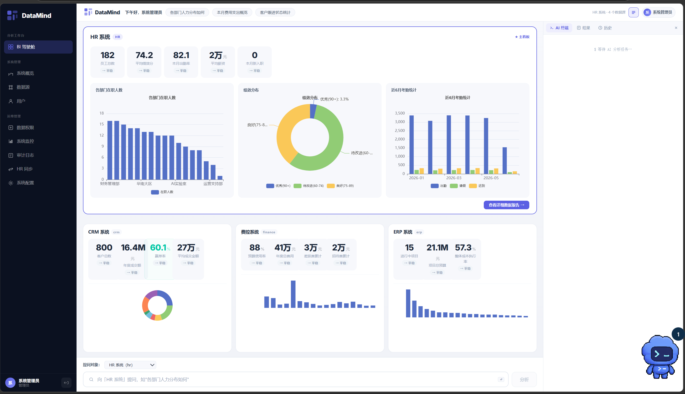

# DataMind — AI 企业数据自助分析平台

> **用自然语言提问，AI 理解你的业务意图**  
> 不再需要学习 SQL 或等待数据团队排期。登录后直接输入问题，Agent 自动完成意图识别、SQL 生成、数据查询、深度分析与可视化报告的全流程。  
> **权限内嵌，安全可控** — 每个查询都在用户的角色权限范围内执行，敏感字段自动脱敏，行级安全策略实时生效。  
> **多数据源统一入口** — 一次接入 HR、CRM、费控、ERP 等多个业务系统，提问时自动路由到对应数据源。



> 🎬 [点击查看产品演示视频](简单演示.wmv)（WMV，48MB，展示从登录到分析报告的全流程）

---

## 目录

- [核心功能](#核心功能)
- [快速开始](#快速开始)
- [架构设计](#架构设计)
- [Agent 工作流程](#agent-工作流程)
- [权限体系](#权限体系)
- [项目结构](#项目结构)
- [API 文档](#api-文档)
- [技术栈](#技术栈)
- [测试](#测试)
- [License](#license)

---

## 核心功能

### 🗣️ 自然语言查询

用中文直接提问，无需 SQL 知识。支持直查、聚合、趋势、对比、排行等多种分析模式：

- "本月费用支出概览" → 费用汇总 + 分类占比 + 预算对比
- "各部门出勤率" → 出勤统计 + 趋势图表
- "绩效排名最高的员工" → TOP N 排行 + 分布分析
- "近 6 个月销售趋势" → 月度趋势 + 增长分析
- "我的个人信息" → 个人档案，敏感字段自动脱敏

### 🧠 深度数据分析

开启「深度分析」开关后，Agent 自动执行完整的数据分析管线：

- **Pandas 统计分析** — 描述统计、缺失值检测、异常值识别、分布特征
- **多维度交叉分析** — 分组对比、占比构成、相关性分析
- **ECharts 可视化** — 柱状图、折线图、饼图、散点图、横向柱状图，自动选择合适的图表类型
- **结构化报告** — 分析结论 + 数据表格 + 图表 + 业务建议

### 🔒 行级安全（RLS）

- **角色权限矩阵**：8 种角色 × 4 个数据源，每种角色有独立的数据范围
- **数据自动脱敏**：salary/phone/email 按角色策略自动脱敏（如 138****8000）
- **行级过滤**：员工只能看自己的数据，部门经理看团队，高管看全部
- **fail-closed 原则**：权限计算失败时拒绝查询，不会退回到无限制状态

### 📊 驾驶舱看板

- **主看板**：当前数据源的核心 KPI + 可视化图表
- **子看板**：其他数据源的缩略展示，点击切换为主看板
- **详细报告**：点击进入完整的数据分析报告页面
- **智能推荐**：根据用户角色和上下文推荐快速提问

### ⚙️ 管理后台

- **数据源管理**：多数据源连接配置与管理
- **用户权限**：角色分配与数据范围控制
- **审计日志**：全量操作记录，支持按用户、操作类型检索
- **系统监控**：组件健康度、24h 运营统计可视化
- **系统配置**：运行时参数管理（LLM 模型、超时时间、分页大小等）
- **HR 同步**：一键同步组织架构与用户数据

---

## 快速开始

### 环境要求

| 组件 | 版本 | 说明 |
|------|------|------|
| Python | 3.12+ | 后端运行环境 |
| Node.js | 18+ | 前端构建 |
| SQLite | 内置 | 开发环境默认（生产可切换 PostgreSQL） |

### 1. 启动后端

```bash
cd backend

# 创建虚拟环境并安装依赖
python -m venv .venv
.venv\Scripts\pip install -r requirements.txt

# 配置环境变量（复制并编辑）
copy .env.example .env
# 在 .env 中填写 DEEPSEEK_API_KEY（DeepSeek 平台获取）

# 启动 FastAPI 服务
.venv\Scripts\uvicorn app.main:app --host 0.0.0.0 --port 8000 --reload
```

首次启动会自动完成：
1. 创建 SQLite 系统数据库与表结构
2. 生成 4 个 Demo 业务数据库（HR / CRM / 费控 / ERP）
3. 同步 189 个用户数据（含不同角色与权限）
4. 预置数据源权限矩阵
5. 写入默认系统配置项

### 2. 启动前端

```bash
cd frontend
npm install
npm run dev
```

访问 [http://localhost:5173](http://localhost:5173)

### 3. 一键启动

双击项目根目录的 `start.bat`，自动完成后端 + 前端的完整启动流程。

### 测试账号

| 用户名 | 密码 | 角色 | 数据范围 | 说明 |
|--------|------|------|----------|------|
| `admin` | `admin123` | 系统管理员 | 全部数据 | 拥有所有管理权限 |
| `emp1` | `emp1@0001` | 部门负责人 | 团队数据 | 技术研发中心主管 |
| `emp2` | `emp2@0002` | 普通员工 | 仅自己 | 高级工程师，可看个人数据 |

---

## 架构设计

### 分层架构

```
用户 → POST /api/query/ask + JWT Token
  │
  ├─ API 层 — 请求校验 + 响应组装
  │    ├─ auth.py              JWT 鉴权
  │    ├─ query.py             统一问答入口
  │    ├─ dashboard.py         驾驶舱面板
  │    └─ admin/*              管理后台路由
  │
  ├─ Orchestrator层 — LangGraph StateGraph 编排
  │    ├─ intent_node          意图识别（24类）
  │    ├─ quality_node         SQL 质量检查
  │    ├─ mcp_agent_node       MCP 业务工具执行
  │    ├─ analysis_node        深度分析 + 可视化
  │    └─ report_node          报告组装
  │
  ├─ MCP Server层 — 业务工具服务
  │    ├─ HR Server            人力/考勤/绩效/组织
  │    ├─ CRM Server           客户/销售/商机
  │    ├─ Finance Server       费用/预算/成本
  │    ├─ ERP Server           库存/项目/采购
  │    └─ MCPAuth（contextvar 隔离，无并发竞态）
  │
  └─ Repository层 — 统一数据访问
       └─ 参数化查询防注入 + 业务口径一致
```

### 核心设计原则

1. **单一入口** — 所有查询统一走 `POST /api/query/ask`，委托 LangGraph OrchestratorAgent 编排完整流程
2. **业务隔离** — 每个业务系统封装为独立的 MCP Server，暴露结构化工具接口
3. **权限内嵌** — 权限上下文通过 Python `contextvars` 在请求内隔离传递，彻底解决全局单例的并发竞态问题
4. **fail-closed** — 权限计算失败时拒绝查询，而非退回到无限制状态
5. **数据访问统一** — 所有 handler 通过 Repository 模式访问数据库，禁止直写 `pd.read_sql`

---

## Agent 工作流程

### 流程图

```
START → context_node → intent_node
                           │
                           ├─ greeting / help → report_node（直接回复）
                           │
                           └─ 其他 → quality_node → mcp_agent_node
                                   │                  │
                                   │ (质量不通过)      │ (deep_analyze=true)
                                   ▼                  ▼
                              report_node        analysis_node
                                                    │
                                                    ▼
                                               report_node → END
```

### 各节点说明

| 节点 | 功能 | 输入 | 输出 |
|------|------|------|------|
| **context_node** | 构建用户上下文 | question, user | AgentContext（角色/范围/会话） |
| **intent_node** | LLM 意图识别 | question + context | IntentType（24类）+ analysis_depth |
| **quality_node** | SQL 质量检查与优化 | SQL + schema | 通过 / 需修复 |
| **mcp_agent_node** | 调用 MCP 业务工具 | intent + params | 结构化查询结果 |
| **analysis_node** | Pandas 深度分析 + ECharts 可视化 | SQL 结果数据 | 分析报告 + 图表配置 |
| **report_node** | 组装 Markdown 最终报告 | 所有上游输出 | 完整报告 |

### 意图分类体系（24类）

| 类别 | 意图 | 说明 |
|------|------|------|
| **直查** | `direct_query` / `list_query` / `aggregation` | 查具体值 / 列记录 / 聚合计算 |
| **分析** | `trend` / `comparison` / `ranking` / `distribution` | 趋势 / 对比 / 排行 / 分布 |
| **分析** | `anomaly` / `root_cause` / `forecast` / `proportion` / `correlation` | 异常检测 / 根因 / 预测 / 占比 / 相关 |
| **业务** | `expense` / `revenue` / `profit` / `budget` | 费用 / 收入 / 利润 / 预算 |
| **业务** | `headcount` / `customer` / `supply_chain` | 人力 / 客户 / 供应链 |
| **交互** | `drill_down` / `refinement` / `cross_domain` | 追问细化 / 粒度调整 / 跨域 |
| **元类** | `greeting` / `help` / `unknown` | 问候 / 能力询问 / 未知 |

---

## 权限体系

### 安全设计

```
请求进入 → JWT 鉴权（HS256）
         → 从 User ORM 推导 role / data_scope / employee_id
         → contextvar 注入 MCPAuth（请求级隔离，无并发竞态）
         → execute_tool 覆写
             ├─ _check_table_access    表级准入检查
             ├─ handler 执行业务逻辑
             └─ _apply_auth            结果集脱敏
```

### 角色权限矩阵

| 角色 | 数据范围 | 敏感字段策略 |
|------|----------|-------------|
| `admin` | 全部数据 | 全部可见（原值） |
| `hr_director` | 部门及下属 | 全部可见（原值） |
| `finance_director` | 全部数据 | 财务相关可见，其余脱敏 |
| `dept_ceo` / `dept_manager` | 本团队 | salary/phone/email 脱敏 |
| `sales_manager` | 本团队 | 联系方式脱敏 |
| `finance_bp` | 本部门 | 财务相关可见 |
| `employee` | 仅自己 | 自己数据中敏感字段脱敏 |
| `viewer` | 部门 | 基础信息，敏感字段脱敏 |

### 数据脱敏规则

```
手机号: 138****8000
邮箱:   zh***@example.com
薪资:   ***
```

### 行级安全（RLS）

| 策略 | SQL 注入条件 |
|------|-------------|
| `self_only` | `WHERE employee_id = 当前用户` |
| `team` | `WHERE dept_id = 当前部门` |
| `dept` | `WHERE dept_id IN (当前部门及所有子部门)` |
| `all` | 无行级限制 |

RLS 通过 `apply_rls_filter` 自动注入 SQL，支持已有 WHERE 的 AND 追加和无 WHERE 的正确插入。

---

## 项目结构

```
DataMind/
├── backend/
│   ├── app/
│   │   ├── api/              # API 路由层
│   │   │   ├── admin/        # 管理后台（监控/审计/配置/权限/HR同步）
│   │   │   ├── auth.py       # 登录注册与 Token 刷新
│   │   │   ├── query.py      # 统一问答入口（核心 API）
│   │   │   ├── dashboard.py  # 驾驶舱面板数据
│   │   │   └── datasources.py # 数据源管理
│   │   ├── core/             # 基础设施层
│   │   │   ├── auth.py       # JWT 鉴权
│   │   │   ├── llm_client.py # LLM 调用客户端
│   │   │   ├── pandas_analyzer.py # 数据分析引擎
│   │   │   ├── reporter.py   # 报告生成
│   │   │   ├── agent_factory.py  # Agent 工厂
│   │   │   └── agent_base.py # Agent 基类
│   │   ├── mcp_servers/      # MCP 服务层
│   │   │   ├── base_sql.py   # SQL Server 基类（权限检查 + RLS）
│   │   │   ├── hr_server.py  # HR 业务工具
│   │   │   ├── crm_server.py # CRM 业务工具
│   │   │   ├── finance_server.py # 费控业务工具
│   │   │   ├── erp_server.py # ERP 业务工具
│   │   │   ├── registry.py   # MCP Server 注册中心
│   │   │   └── repositories/ # 统一数据访问层（Repository 模式）
│   │   ├── models/           # SQLAlchemy 数据模型
│   │   │   ├── user.py       # 用户模型
│   │   │   ├── datasource.py # 数据源模型
│   │   │   ├── conversation.py # 对话记录
│   │   │   ├── audit_log.py  # 审计日志
│   │   │   ├── permission.py # 权限模型
│   │   │   └── system_config.py # 系统配置
│   │   ├── orchestrator/     # LangGraph 编排层
│   │   │   ├── graph/        # StateGraph 构建
│   │   │   ├── nodes/        # 各流程节点
│   │   │   │   ├── context_node.py # 上下文构建
│   │   │   │   ├── intent_node.py  # 意图识别
│   │   │   │   ├── quality_node.py # SQL 质量
│   │   │   │   ├── mcp_agent_node.py # MCP 执行
│   │   │   │   ├── analysis_node.py # 深度分析
│   │   │   │   └── report_node.py  # 报告组
│   │   │   ├── state.py      # AgentState + 路由函数
│   │   │   ├── errors.py     # 友好错误处理
│   │   │   └── datasource_router.py # 智能数据源检测
│   │   ├── schemas/          # Pydantic 请求响应模型
│   │   ├── main.py           # 应用入口
│   │   └── seed.py           # 种子数据初始化
│   ├── tests/                # 测试用例（25+ 项）
│   │   ├── test_repositories.py   # 数据访问层测试
│   │   ├── test_mcp_auth_rls.py   # 权限回归测试
│   │   └── ...
│   └── scripts/              # 开发辅助脚本
│
├── frontend/
│   └── src/
│       ├── api/              # 7 个 API 模块（axios 封装）
│       ├── components/       # Vue 公共组件
│       │   ├── KpiCard.vue   # KPI 指标卡
│       │   ├── PanelCard.vue # 面板卡片
│       │   ├── QueryInput.vue # 查询输入框
│       │   └── MarkdownReport.vue # 报告渲染
│       ├── router/           # 路由配置
│       ├── stores/           # Pinia 状态管理
│       ├── styles/           # 全局样式
│       └── views/            # 页面视图
│           ├── Login.vue
│           ├── analyst/      # 分析师驾驶舱
│           └── dashboard/    # 管理后台
│
├── demo_data/                # Demo 业务数据库
├── sandbox/                  # 沙箱执行环境（Docker）
├── docker-compose.yml        # Docker 部署配置
├── start.bat                 # 一键启动脚本
├── AGENTS.md                 # AI Agent 开发规范
└── README.md                 # 本文件
```

---

## API 文档

### 核心接口

| 端点 | 方法 | 说明 |
|------|------|------|
| `/api/auth/login` | POST | 登录获取 JWT Token |
| `/api/auth/refresh` | POST | 刷新 Token |
| `/api/query/ask` | POST | **统一问答入口**（委托 LangGraph Agent） |
| `/api/query/history` | GET | 查询历史记录 |
| `/api/dashboard/panels` | GET | 驾驶舱面板数据 |
| `/api/datasources` | GET | 可用数据源列表 |

### 管理后台接口

| 端点 | 方法 | 说明 |
|------|------|------|
| `/api/admin/configs` | GET / PUT | 系统配置管理 |
| `/api/admin/audit-logs` | GET | 审计日志查询与检索 |
| `/api/admin/monitor/health` | GET | 组件健康度检查 |
| `/api/admin/monitor/stats` | GET | 24h 运营统计 |
| `/api/admin/permissions/users` | GET / PUT | 用户权限管理 |
| `/api/admin/permissions/datasources` | GET / PUT | 数据源权限管理 |
| `/api/admin/hr-sync/trigger` | POST | 触发 HR 同步 |
| `/api/admin/hr-sync/status` | GET | 同步状态查询 |

完整的交互式 API 文档请访问 [http://localhost:8000/docs](http://localhost:8000/docs)（Swagger UI）。

---

## 技术栈

| 层 | 技术 |
|------|------|
| 后端框架 | Python 3.12+ / FastAPI |
| AI 编排 | LangGraph（StateGraph） |
| ORM | SQLAlchemy（async） |
| LLM | DeepSeek Chat API |
| 数据分析 | Pandas / NumPy |
| 数据可视化 | ECharts（前端渲染） |
| 前端框架 | Vue 3 + TypeScript |
| 构建工具 | Vite |
| UI 组件 | Element Plus |
| 状态管理 | Pinia |
| 权限机制 | contextvars / JWT（HS256） |
| 数据库 | SQLite（开发） / PostgreSQL（生产） |
| 容器化 | Docker / Docker Compose |
| 测试 | pytest（25+ 测试用例） |

---

## 测试

```bash
cd backend

# 运行全部测试
.venv\Scripts\python -m pytest tests/ -v

# 运行数据访问层测试（不依赖外部数据）
.venv\Scripts\python -m pytest tests/test_repositories.py -v

# 运行权限回归测试（推荐改动前后执行）
.venv\Scripts\python -m pytest tests/test_mcp_auth_rls.py -v
```

测试覆盖范围：

| 模块 | 用例数 | 说明 |
|------|--------|------|
| Repository 数据访问层 | 38 | 增删改查 + 权限过滤 |
| MCPAuth 权限矩阵 | 10 | 角色 × 数据源组合验证 |
| 行级安全 RLS | 8 | 4 种策略 + 边界情况 |
| Agent 编排流程 | 6 | 端到端 LangGraph 执行 |
| SQL 质量检查 | 4 | 注入检测 + 语法验证 |
| 鉴权认证 | 4 | JWT + Token 刷新 |

---

## License

MIT
